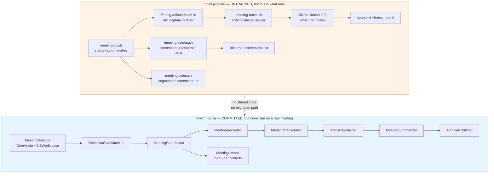

# OmniPilot Meetings — State Report

*The meeting note-taker we built and use: what exists, what runs, what is at risk.*

::: {.report-meta}

| | |
|:--|:--|
| **Project** | OmniPilot — Pillar M (Meetings) |
| **Version** | `v0.1` state report |
| **Status** | Working in production use — but unversioned and unmerged |
| **Repo** | `soumyaswain8-droid/omnipilot` (private) |
| **Created** | 2026-08-19 |
| **Updated** | 2026-08-19 |

:::

::: {.doc-author}

| | |
|:--|:--|
| **Author** | Soumya Swain |
| **Email** | soumya@suryaai.co.in |

:::

## TL;DR

Yes — there is a repo: **`soumyaswain8-droid/omnipilot`** (private). There is **no dedicated meeting-notes repo**; the note-taker lives inside OmniPilot as "Pillar M".

But the repo does not contain the thing you actually use. The system exists as **two disconnected implementations**:

1. **The shell pipeline** — `meeting-ctl.sh`, `meeting-notes.sh`, `meeting-screen.sh`, `meeting-video.sh`, `finalize_notes.py`. This produced **every meeting note you have**. It is **entirely untracked** — never committed, on no branch, backed up nowhere.
2. **The Swift module** — 894 LOC across `Sources/Meetings/` + a full test target, 17 commits on `feat/meetings-m1`. Pushed to GitHub, **never merged to `main`**, and **never used to capture a real meeting**.

The working code is unversioned. The versioned code has never run. That is the single finding of this report.

## The two implementations



### Side by side

::: {.gap-table}

| Dimension | Shell pipeline | Swift module | Gap |
|:----------|:---------------|:-------------|:----|
| In git | **No — untracked** | Yes, `feat/meetings-m1` | Working code unversioned |
| Merged to `main` | n/a | **No — 17 commits behind** | `main` last touched 2026-07-03 |
| Real meetings captured | **3** | **0** | Untested against reality |
| Tests | None | 10 test files, incl. end-to-end | Inverted: tested code unused |
| Screen OCR | Yes (tesseract) | **Not implemented** | OCR is what saved both real notes |
| Video capture | Yes (segmented) | **Not implemented** | — |
| Both-sides audio | **No — mic only** | No — mic only | Same blind spot in both |
| Menu-bar control | No (CLI only) | Yes | — |

:::

## Capture inventory

Three meetings recorded, all mic-only, all in `data/meetings/`.

::: {.inventory-table}

| Capture | Duration | Outcome |
|:--------|---------:|--------:|
| `mic_2026-07-15` — AI Tools Workshop | 2h15m | **Failed / hallucinated** |
| `meet_2026-08-06` — LiveXCapital sales call | 34m08s | Partial (17m clean) |
| `workshop_2026-08-09` — FlexiFunnels webinar | 75m38s | **Good** |

:::

**2026-07-15 — the failure that triggered the redesign.** AirPods were the output device, so remote audio played into the AirPods and never reached the mic (`avfoundation :0` captures the wearer's side only). The transcript came out as ~1.2 KB of sound-effect tags, and `finalize_notes.py` confabulated a complete, confident, entirely fake summary from it. The note now carries a `DO NOT TRUST — hallucinated` banner at the top. Only the OCR-harvested URLs were real.

**2026-08-06 — half-captured.** Clean transcript for 00:00–17:03, then genuine audio failure on the caller's side. OCR carried the links through when audio did not.

**2026-08-09 — the one that worked.** Full 75 minutes of clean audio, no dropout. Two remaining limits: the model is `ggml-small.en` (English-only) and the presenter switched to Hindi frequently — roughly 20–25% of speech is lost or mangled. And Whisper mangles numbers badly, so every financial figure in that note had to be cross-checked against OCR.

**The pattern across all three: screen OCR is doing more load-bearing work than the audio transcription.** Every URL, every reliable number, and the only trustworthy content from the failed July capture came from tesseract, not Whisper.

## Repo status

::: {.metrics-table}

| Item | State |
|:-----|:------|
| Remote | `https://github.com/soumyaswain8-droid/omnipilot.git` (private) |
| Current branch | `feat/meetings-m1` |
| Branch vs origin | In sync — 0 ahead, 0 behind |
| Branch vs `main` | **17 commits ahead, unmerged** |
| `main` last commit | 2026-07-03 — `fix(omnipilot): Phase 1 Inc 1 neural VAD` |
| Dedicated meetings repo | **None** — Pillar M lives inside OmniPilot |

:::

The 17 unmerged commits are a clean, well-decomposed M1: domain models, detection state machine, transcript builder, map-reduce summarizer with injectable LLM, archive layout + publisher, mic recorder, rolling transcriber, CoreAudio detector, coordinator with graceful degradation, menu-bar wiring, and an end-to-end integration test. It is finished work sitting on a shelf.

## Risks

### 1. Private meeting transcripts are one `git add -A` away from GitHub

This is the urgent one. `.gitignore` covers `*.wav`, so the audio is safe. It does **not** cover the transcripts and notes:

```
$ git check-ignore -v data/meetings/.../meet_2026-08-06_15-39-21.notes.md
NOT IGNORED -> would be committed
```

`data/` currently shows as untracked only because nothing has staged it yet. A single `git add -A` would push to a GitHub repo:

- a full transcript of a **sales call**, including your own questions about compliance and capital
- a webinar transcript with **your own background browser tabs OCR'd into it** — the Aug 6 note explicitly lists `devpilot.co`, `sidewall.in`, `suryaai.co`, `enquirypilot.dev`, `gmail.com`, `accounts.google` as captured-from-screen
- `screen-text.txt` files that, per the Aug 9 note, captured **your own terminal windows including Claude Code output**

The repo is private, which limits blast radius, but this is not content that should be in version control at all.

### 2. The working pipeline exists in exactly one place

Five files — 355 lines of shell plus 67 lines of Python — with no copy anywhere. No commit, no branch, no backup. Losing that directory loses the entire working system, and the Swift module is not a substitute because it has no OCR, no video, and has never captured a real meeting.

### 3. The both-sides audio design has been paused for 35 days

`docs/superpowers/specs/2026-07-15-meeting-capture-start-design.md` carries **`Status: DRAFT — presented to Soumya 2026-07-15, PAUSED awaiting approval.`**

The design is complete and the decisions are locked: a driver-free Core Audio process tap (`omni-audiotap`, ~150 lines of Swift, no BlackHole, no admin install), live-mixed with the default mic into one WAV that `meeting-notes.sh` already knows how to watch. Plus `meeting-ctl.sh start` with pre-flight checks — disk space, which devices are actually being captured, whisper-server health — specifically so the silent-AirPods trap becomes impossible. Plus a thin-transcript guard so `finalize_notes.py` refuses to summarise when there is not enough real speech.

It is waiting on one thing: your approval to proceed to spec.

Meanwhile **every capture since remains mic-only**, and the July 15 failure mode is still live.

### 4. Known unfixed bug

The design doc records that `meeting-ctl.sh stop` uses a pkill pattern (`whisper-server -m`) that never matches the actual `--model` invocation — so whisper-server is not being killed on stop. Small, but it means a stray server process survives every session.

## Recommended next steps

::: {.task-table-3}

| # | Action | Priority |
|:--|:-------|:---------|
| 1 | Add `data/` to `.gitignore` before anything else touches this repo | **Critical** |
| 2 | Commit the five shell scripts to `feat/meetings-m1` — they are the working system | **Critical** |
| 3 | Approve or revise the paused both-sides-capture design | **High** |
| 4 | Decide: merge `feat/meetings-m1` to `main`, or park it explicitly | **High** |
| 5 | Swap `ggml-small.en` for a multilingual model — 20–25% of Hindi-English speech is being lost | Medium |
| 6 | Fix the `whisper-server` pkill pattern in `meeting-ctl.sh stop` | Medium |
| 7 | Port screen OCR into the Swift module, or accept shell as the permanent implementation | Medium |

:::

Items 1 and 2 are two commands and remove both standing risks. Item 4 is the real decision underneath all of this: **is the Swift module the future of this system, or is the shell pipeline the product?** Right now you are paying maintenance on both and getting the benefits of neither.
