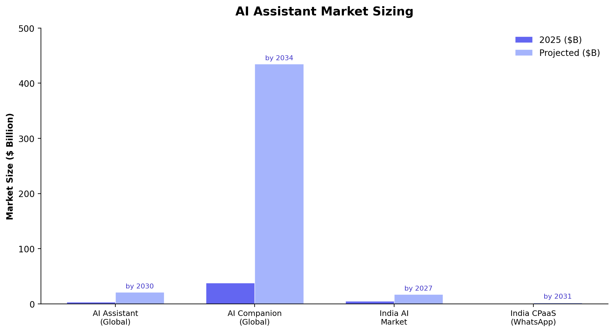
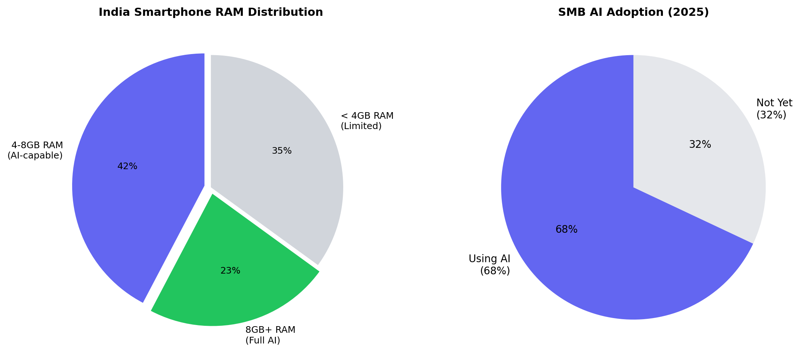
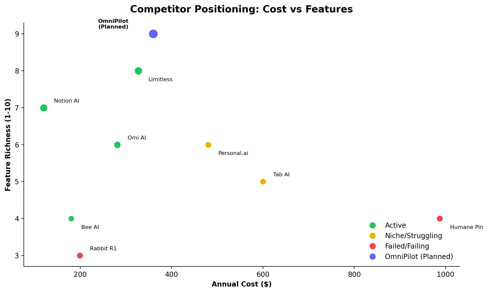
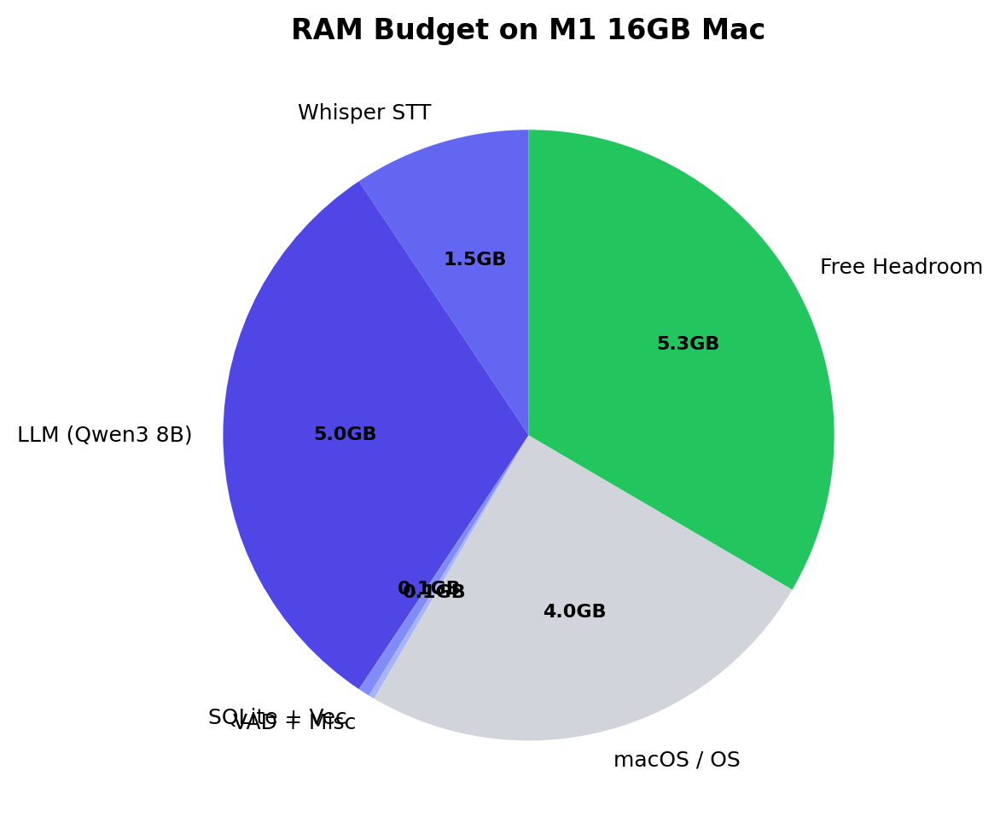
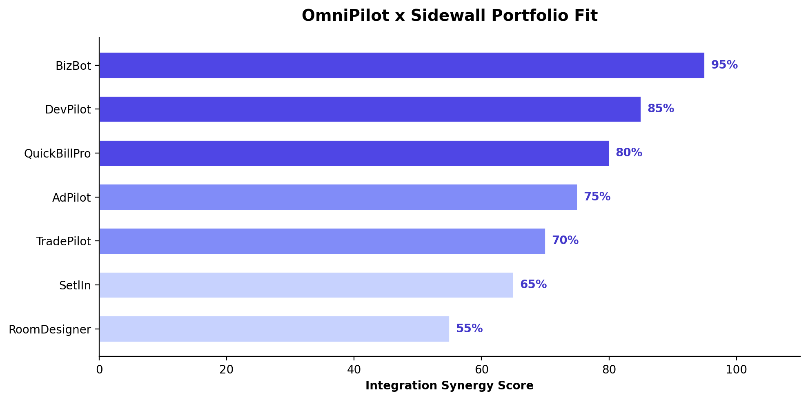
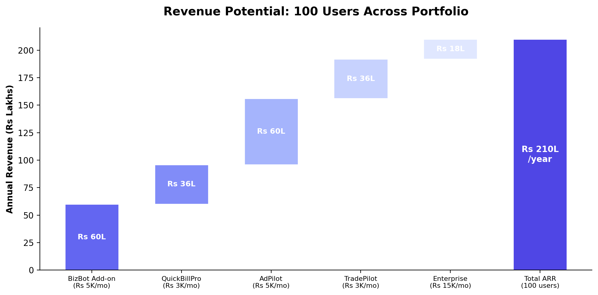

# OmniPilot: Personal AI Assistant Research

*Voice-first, local-first, multi-interface AI companion*

::: {.report-meta}

| | |
|:--|:--|
| **Project** | OmniPilot |
| **Version** | `v0.1.0` |
| **Status** | Research Phase |
| **Created** | 2026-04-16 |
| **Updated** | 2026-04-16 |

:::

::: {.doc-author}

| | |
|:--|:--|
| **Author** | Soumya Swain |
| **Email** | soumya@sidewall.in |
| **LinkedIn** | [linkedin.com/in/kishorer747](https://www.linkedin.com/in/kishorer747) |

:::

---

## Executive Summary

OmniPilot is a personal AI assistant inspired by Omi AI — an always-listening, always-remembering companion that works across desktop, WhatsApp, and mobile. Unlike Omi (hardware pendant) or Humane (failed AI Pin), OmniPilot is **software-only and local-first** — everything runs on your Mac/phone, no data leaves your device.

**The big opportunity:** OmniPilot isn't just another AI assistant. It becomes the **unified voice interface** across the entire Sidewall product portfolio — BizBot, AdPilot, QuickBillPro, TradePilot, and more. One assistant to manage all your businesses, investments, and life.

**Key findings from this research:**
- Hardware AI devices have universally failed ($700 Humane Pin is dead, Rabbit R1 has 95% abandonment)
- Software-first, phone-native assistants are winning
- India is a $5.1B AI market growing to $17B by 2027
- WhatsApp-first distribution is the unlock for India (78% of SMBs already use WhatsApp for business)
- The tech stack is ready: Whisper + Ollama + SQLite all run locally on M-series Macs
- BizBot integration alone could generate Rs 60L/year ARR from 100 users

---

## 1. Market Opportunity

### Market Size



| Segment | 2025 Size | Projected | Growth |
|---------|-----------|-----------|--------|
| Global AI Assistant | $3.35B | $21.1B by 2030 | 44.5% CAGR |
| AI Companion (Global) | $37.7B | $435B by 2034 | 31.2% CAGR |
| India AI Market | $5.1B | $17B by 2027 | 3x growth |
| India CPaaS (WhatsApp) | $1.12B | $2.36B by 2031 | 13% CAGR |

### India is the Right Market



**Why India works for OmniPilot:**

- **1.03 billion internet users** (70% penetration), 660M smartphones
- **78% of Indian SMBs** already use WhatsApp for business — that's our distribution channel
- **65% of 4GB+ phones** can run lightweight on-device AI — the hardware is ready
- **68% of SMBs** are already using AI tools — adoption is mainstream, not early
- **Rs 399-500/month** ($5-6) is the proven price point — Google and OpenAI validated this
- **$1.17B government IndiaAI Mission** backing democratization

**Pricing reality for India:**
- Consumer sweet spot: Rs 399-500/month ($5-6)
- SMB tools: Rs 1,000-2,000/month ($12-24)
- WhatsApp automation: Rs 8,000-15,000/month for SMBs
- Above Rs 2,000/month? Adoption drops sharply outside enterprise

<div class="page-break"></div>

## 2. Competitor Landscape

### The Battlefield



### Detailed Comparison

::: {.changes-table}

| Product | Type | Price | Status | Key Learning |
|---------|------|-------|--------|--------------|
| **Omi AI** | Hardware pendant | $89 + $16/mo | Active | Cheap hardware works. Transcription accuracy is the weak point |
| **Limitless** (ex-Rewind) | Software + Pendant | $99 pendant + $19/mo | Active, strongest player | Meeting intelligence is the beachhead feature |
| **Tab AI** | Hardware pendant | $600 | Early, unproven | Price too high. Concept good, execution unvalidated |
| **Bee AI** | Software app | $15/mo | Active, niche | Software-first pivot was smart. Hard to differentiate |
| **Rabbit R1** | Hardware device | $199 | Struggling, 95% abandonment | Everything it does, a phone does better |
| **Humane AI Pin** | Hardware wearable | $699 + $24/mo | Dead. Bricked Feb 2025 | Cautionary tale. Never be 10x worse than a phone |
| **Notion AI** | Software (workspace) | $10/mo add-on | Active, widely adopted | Workspace AI, not personal companion |
| **Personal.ai** | Software | $40/mo | Active, slow adoption | Cold-start problem — needs lots of data before useful |

:::

### What the Winners Got Right

| Pattern | Evidence |
|---------|----------|
| **Software-first beats hardware-first** | Limitless, Notion, Bee AI all healthy. Humane, Rabbit failed |
| **Meeting intelligence is the beachhead** | Every successful product started with "make meetings useful" |
| **Sub-$100 hardware is the ceiling** | $89 Omi sells. $199+ Rabbit struggles. $699 Humane dies |
| **Privacy is a selling point** | Users accept cloud IF they trust. Fully local is a niche differentiator |
| **Phone is the real competitor** | Any device must be 10x better than a phone app — not 10x worse |

### Open-Source Alternatives (Build Blocks for OmniPilot)

| Project | What It Does | Maturity |
|---------|-------------|----------|
| **whisper.cpp** | Local speech-to-text, runs on Mac Metal | Mature, production-ready |
| **Ollama** | Local LLM server (Llama 3, Qwen3) | Mature, widely used |
| **Khoj** (khoj.dev) | Open-source personal AI with memory | Active, growing |
| **Silero VAD** | Voice Activity Detection (0.4% CPU) | Mature, MIT license |
| **SQLite-vec** | Vector search in SQLite | Active, production-ready |
| **Omi firmware** | Open-source wearable firmware | Community-driven |

**Bottom line:** The building blocks exist. No one has assembled them into a product that integrates with a business portfolio.

<div class="page-break"></div>

## 3. Technical Architecture

### Recommended Stack



Everything runs on your M1/M2/M3 Mac with 16GB RAM — no cloud needed.

| Layer | Tool | Why This One | RAM |
|-------|------|-------------|-----|
| **Voice Detection** | Silero VAD | 0.4% CPU, MIT license, no telemetry | 50MB |
| **Speech-to-Text** | whisper.cpp + CoreML | 27x real-time on M1, runs locally | 1.5GB |
| **AI Brain** | Ollama + Qwen3 8B | 20-30 tokens/sec, REST API, easy setup | 5GB |
| **Memory DB** | SQLite + sqlite-vec + FTS5 | Single file, works everywhere, hybrid search | 100MB |
| **Embeddings** | all-MiniLM-L6-v2 | 384-dim vectors, 80MB model, fast | 80MB |
| **Wake Word** | Picovoice Porcupine | Custom words ("Hey Pilot"), <1% CPU | 10MB |
| **macOS App** | Swift menu bar app | Native audio capture, low power | - |
| **Mobile App** | Flutter | Cross-platform, on-device Whisper | - |
| **Sync** | Local HTTP API + Syncthing | No cloud, LAN only | - |
| **WhatsApp** | WhatsApp Cloud API | Official, 1000 free conversations/month | - |

### How It Works (Simplified)

```
You speak
   |
   v
[Silero VAD] -- Is someone talking? 
   |                     |
  Yes                    No --> discard (saves battery)
   |
   v
[Whisper] -- Convert speech to text (200ms per chunk on M1)
   |
   v
[SQLite Memory] -- Store with timestamp, people, topics
   |
   v
[Ollama LLM] -- Summarize, extract action items, answer questions
   |
   v
[You get] -- Daily summaries, reminders, answers to "what did I discuss?"
```

### Key Technical Decisions

| Decision | Choice | Why |
|----------|--------|-----|
| **Local vs Cloud** | Local-first | Privacy, no subscription, works offline |
| **Whisper model** | `small.en` (466MB) | Best accuracy/speed tradeoff on M1 |
| **LLM model** | Qwen3 8B Q4 | Fastest quality model that fits in 5GB |
| **Database** | SQLite (not Postgres) | Single file = easy sync between devices |
| **Mobile framework** | Flutter | Cross-platform, existing team experience |
| **Sync method** | Local API over WiFi | No cloud dependency, Mac is the hub |

### Flutter Mobile Stack

| Component | Package | Notes |
|-----------|---------|-------|
| On-device STT | `whisper_flutter_new` | Wraps whisper.cpp for iOS/Android |
| Voice detection | `vad` | Silero VAD wrapper |
| Local DB | `sqflite` + sqlite-vec | Same schema as desktop |
| Background mic | Native plugins | Needs OS-level permissions |

<div class="page-break"></div>

## 4. Product Portfolio Integration

### Synergy Scores



### Integration Map: One Assistant, Seven Products

```
                    "Hey OmniPilot..."
                          |
                    [NLU + Context]
                          |
     +--------+--------+--------+--------+--------+--------+
     |        |        |        |        |        |        |
  BizBot  QuickBill  AdPilot  DevPilot  Trade   SetlIn  Design
  (95%)   Pro(80%)   (75%)    (85%)     Pilot   (65%)   Pilot
                                        (70%)           (55%)
```

### Per-Product Integration

#### BizBot (Synergy: 95%) -- HIGHEST PRIORITY

BizBot automates WhatsApp/Email/Call for businesses. OmniPilot becomes the **voice layer on top**.

| Voice Command | What Happens |
|--------------|-------------|
| "Reply to that caller — tell them we'll send the quote by 5 PM" | OmniPilot routes response through BizBot's WhatsApp |
| "What did Brand Tusker's last message say?" | Reads BizBot conversation history aloud |
| "How many inquiries did we get today?" | "12 WhatsApp, 3 emails, 1 missed call. 2 need your reply." |
| *Overhears a phone call with prospect* | Auto-creates a lead in BizBot with context notes |

**Revenue:** Rs 5K-8K/month add-on to existing BizBot subscription.

#### QuickBillPro (Synergy: 80%)

| Voice Command | What Happens |
|--------------|-------------|
| "Send invoice to Brand Tusker — Rs 2.3 lakhs plus GST" | Creates and sends invoice via QuickBillPro |
| "How much does client X owe me?" | Instant AR aging without opening the app |
| *Overhears "the payment came through"* | Auto-marks invoice as paid |

#### AdPilot (Synergy: 75%)

| Voice Command | What Happens |
|--------------|-------------|
| "What's my ROAS on the Brand Tusker campaign?" | Instant metrics without dashboards |
| "Pause underperforming campaigns" | Hands-free campaign control |
| "Alert me if any campaign CPC crosses Rs 15" | Proactive monitoring |

#### DevPilot (Synergy: 85%)

| Voice Command | What Happens |
|--------------|-------------|
| "What's the sprint status for TradePilot?" | Pulls from DevPilot DB (43 MCP tools) |
| "Mark task STAB-003 as done" | Voice-driven task updates |
| *Developer says "same bug as P2P"* | Searches learnings DB, surfaces the fix |

#### TradePilot (Synergy: 70%)

| Voice Command | What Happens |
|--------------|-------------|
| "How's my portfolio today?" | Real-time P&L summary |
| "What regime is Nifty in?" | Market state without screens |
| *OmniPilot detects market news* | "Reliance dropped 4%. You have an open position." |

#### SetlIn (Synergy: 65%)

| Voice Command | What Happens |
|--------------|-------------|
| "I need an electrician near Koramangala" | Triggers SetlIn's service recommendations |
| *Overhears "we just moved"* | Auto-triggers SetlIn onboarding flow |

#### RoomDesigner (Synergy: 55%)

| Voice Command | What Happens |
|--------------|-------------|
| "Show me modern kitchen designs for 10x12" | Triggers DesignPilot generation |
| *While furniture shopping* | "Would this sofa fit my living room design?" |

### Cross-Product Intelligence (The Real Moat)

Single-product queries are useful. **Cross-product commands are transformational:**

> "Brand Tusker's campaign is performing well. Send a thank-you on WhatsApp and draft next month's invoice."
> *AdPilot + BizBot + QuickBillPro in one command*

> "My TradePilot profits this month are Rs 50K. How much GST do I owe?"
> *TradePilot + QuickBillPro*

> "What's the status across all my projects?"
> *DevPilot sprints + AdPilot campaigns + TradePilot positions + BizBot conversations*

<div class="page-break"></div>

## 5. Revenue Model

### Revenue Potential



### Pricing Tiers

| Tier | What's Included | Price | Target |
|------|----------------|-------|--------|
| **Personal** (Free) | Desktop companion, memory, daily summaries | Rs 0 | Personal use, dogfooding |
| **Pro** | + WhatsApp bot + 2 product integrations | Rs 499/mo | Individual professionals |
| **Business** | + All product integrations + cross-product commands | Rs 1,999/mo | SMB owners |
| **Enterprise** | + Custom integrations + team features | Rs 15,000+/mo | Companies |

### B2B Add-On Pricing (Existing Customers)

| Product | Add-on Price | Pitch |
|---------|-------------|-------|
| BizBot customers | +Rs 5K-8K/mo | "Manage BizBot with your voice — reply, check leads, send quotes, hands-free" |
| AdPilot + QuickBillPro | +Rs 3K-5K/mo per product | "One assistant for your ads AND invoices" |
| Enterprise custom | Rs 50K setup + Rs 15-25K/mo | Custom OmniPilot connected to company tools |

### Unit Economics (at 100 users)

| Revenue Stream | Monthly | Annual |
|----------------|---------|--------|
| BizBot add-on (100 users x Rs 5K) | Rs 5L | Rs 60L |
| QuickBillPro add-on (100 users x Rs 3K) | Rs 3L | Rs 36L |
| AdPilot add-on (100 users x Rs 5K) | Rs 5L | Rs 60L |
| TradePilot add-on (100 users x Rs 3K) | Rs 3L | Rs 36L |
| Enterprise (10 users x Rs 15K) | Rs 1.5L | Rs 18L |
| **Total ARR** | **Rs 17.5L/mo** | **Rs 2.1 Cr** |

<div class="page-break"></div>

## 6. Competitive Moat

### Why OmniPilot Beats Standalone Assistants

| Dimension | Omi / Limitless | OmniPilot (Sidewall) |
|-----------|----------------|---------------------|
| Memory | Generic life logging | Domain-specific memory per product |
| Actions | Limited API integrations | Deep actions across 7 products |
| Context | Personal conversations only | Personal + business + financial + creative |
| Revenue | Hardware margins + subscription | SaaS recurring per product vertical |
| Moat | Commodity hardware | Proprietary product integrations |
| India | No India-specific features | GST, WhatsApp-first, INR, Indian languages |

### The Flywheel

```
More Sidewall products --> More cross-product context --> Smarter OmniPilot
       ^                                                        |
       |                                                        v
  More users  <----  Higher retention  <----  More value per query
```

Each new product in the Sidewall portfolio makes OmniPilot more valuable. This flywheel cannot be replicated by standalone AI assistant companies.

### Five Layers of Defensibility

1. **Proprietary product graph** — Deep integrations with 7 products spanning ads, billing, communication, trading, design, productivity
2. **Shared context across domains** — Knows your invoice AND your campaign AND your trade position. Context compounds
3. **Indian market depth** — GST compliance, WhatsApp-first, INR trading, Indian city services. Global competitors don't serve these
4. **Existing customer base** — BizBot, AdPilot, QuickBillPro already have paying customers. OmniPilot is an upsell, not a cold start
5. **DevPilot engine** — Battle-tested sprint/task/knowledge infrastructure powers OmniPilot's backend

<div class="page-break"></div>

## 7. What Failed and Why (Lessons)

| Product | What Went Wrong | Lesson for OmniPilot |
|---------|----------------|---------------------|
| **Humane AI Pin** ($699) | Solved no problem better than a phone. Overheated. Bricked in Feb 2025 | Never build hardware that's worse than a phone app |
| **Rabbit R1** ($199) | 95% abandonment in 5 months. "A $199 Android app" | Software-first. Phone is the platform |
| **Personal.ai** | Cold-start problem — needs tons of data before useful | Seed OmniPilot's memory from existing product data (BizBot chats, DevPilot sprints) |
| **Tab AI** ($600) | Too expensive, unproven at scale | Start free/cheap. Prove value before charging |
| **Generic AI assistants** | No daily habit. "Cool demo, never opened again" | Integrate into existing workflows (BizBot, invoicing) — don't create new habits |

### The Golden Rule from Failures

> "The bar is not 'better than nothing' but 'better than a smartphone app.' Software on existing devices wins. Hardware-first dies."

## 8. Build Roadmap

| Phase | Timeline | What Gets Built | Milestone |
|-------|----------|----------------|-----------|
| **Phase 1** | Week 1-2 | Desktop companion (Mac menu bar, Whisper + Ollama + SQLite) | "Listen and remember" working |
| **Phase 2** | Week 3-4 | WhatsApp bot (voice note processing, same memory) | Voice note to memory pipeline |
| **Phase 3** | Month 2 | Flutter mobile app (on-device STT, background mic) | Full mobile companion |
| **Phase 4** | Month 2-3 | BizBot integration (voice-to-WhatsApp, CRM queries) | First product integration |
| **Phase 5** | Month 3+ | Remaining product integrations + proactive intelligence | Full portfolio assistant |
| **Phase 6** | Month 4+ | Hardware exploration (Bluetooth pendant, smart watch) | Optional hardware layer |

### Phase 1 Technical Checklist

- [ ] Install Ollama + pull Qwen3 8B model
- [ ] Set up whisper.cpp with CoreML backend
- [ ] Create Swift menu bar app with hotkey listener
- [ ] Implement Silero VAD for voice detection
- [ ] Design SQLite memory schema (memories, people, topics, decisions)
- [ ] Build hybrid search (FTS5 + sqlite-vec)
- [ ] End-of-day summary generation via LLM
- [ ] "What did I discuss about X?" query interface

---

## Sources

- MarketsAndMarkets — AI Assistant Market Size Report
- Fortune Business Insights — AI Companion Market & India AI Market
- Precedence Research — AI Companion Market
- IBEF — India AI Market Projections
- Hyperleap AI — WhatsApp Business Statistics India 2026
- DataReportal — Digital 2026 India
- USM Systems — Small Business AI Adoption Statistics
- Whisper.cpp GitHub — Performance Benchmarks
- SQLite-vec GitHub — Vector Search Documentation
- Silero VAD GitHub — Voice Activity Detection
- EverydayAITech — AI Gadget Flops 2025
